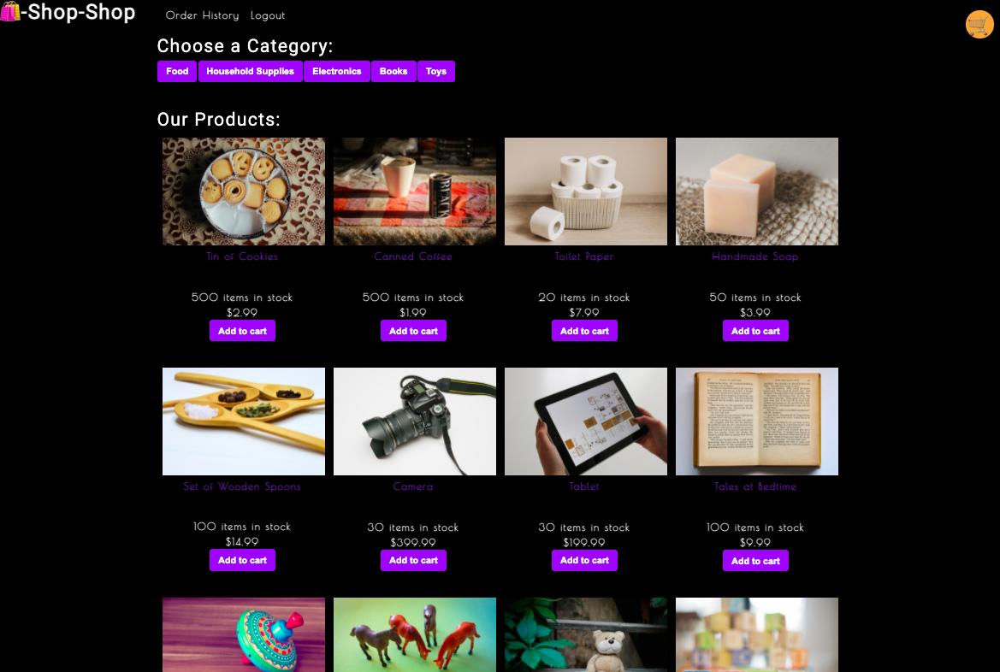

# Redux State

## Description
This application is an e-commerce platform built with a refractored code using Redux and State. As a result, an software engineer who will be working on this e-commerce platform will be able to use Redux to manage global state instead of the Context API so that the website's state management is taken out of the React ecosystem. 

&nbsp;

## Built With
* HTML 
* CSS
* NPM Install
* Inquirer
* JavaScript
* Redux
* State

&nbsp;

## Sneak Peek
&nbsp;

&nbsp;

## Deployed Site
https://redux-state-wk.herokuapp.com/

&nbsp;

## Contribution Guidelines

Made by Winter Kanda 

@2021 Copyright